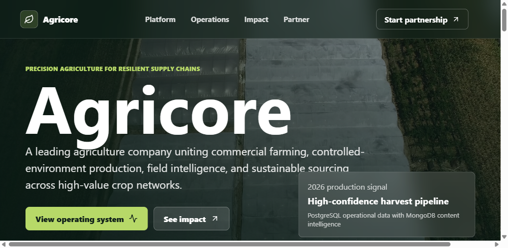
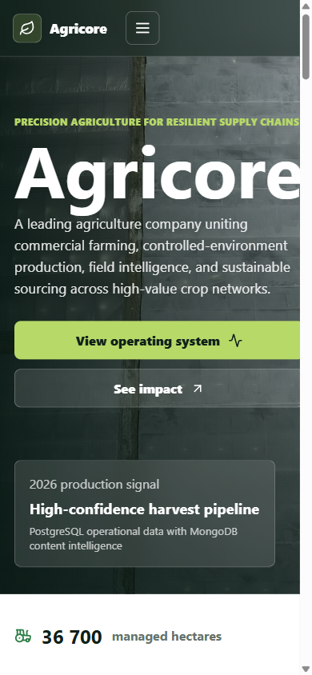

# Agricore Enterprise Agriculture Platform

Agricore Enterprise Agriculture Platform is a full-stack agriculture company website and operating dashboard with separate frontend and backend applications. It uses a React + TypeScript frontend, Node.js + Express backend, MongoDB, PostgreSQL, Docker Compose, real agriculture media, and a clean enterprise folder structure.

The goal of this project is to demonstrate senior full-stack engineering fundamentals for an agriculture business platform: separate services, database-backed API design, structured operational data, flexible content storage, lead capture validation, responsive frontend composition, reusable components, environment-based configuration, containerized development, and a premium public-facing user experience for a leading agriculture company called Agricore.

## Features

Premium responsive Agricore landing experience with real agriculture video and image media.

Separate frontend and backend folders.

React + TypeScript frontend built with Vite.

Node.js + Express backend with modular routes, controllers, services, middleware, validators, and models.

MongoDB stores flexible impact stories and enterprise partnership leads.

PostgreSQL stores structured farm sites and crop forecast data.

Docker Compose starts frontend, backend, MongoDB, and PostgreSQL together.

Backend health endpoint reports MongoDB and PostgreSQL connectivity.

Frontend API helper includes fallbacks so the UI still renders if the backend is temporarily unavailable.

Lead form validates data on the backend with Zod before saving to MongoDB.

PostgreSQL initialization script seeds Agricore farm sites and crop forecasts.

Responsive navigation supports desktop and mobile layouts.

Frontend code is split into reusable page sections, hooks, data files, and formatting utilities.

Backend code is split into thin route files, controllers, service layers, database helpers, and middleware.

Local dependencies are installed so VS Code can resolve React, TypeScript, Express, Mongoose, PostgreSQL, and Zod imports.

## Screenshots

### Desktop Home

Agricore desktop homepage with full-screen agriculture video, executive metrics, farm operations, impact stories, and partnership capture.



### Mobile Home

Agricore mobile layout with responsive navigation and optimized first-viewport content.



## Main User Experience

Agricore is designed as an enterprise agriculture brand and operating platform.

Visitors can:

View Agricore positioning and services.

Inspect high-level operating metrics.

Review active farm sites and crop forecasts.

Read sustainability and impact stories.

Submit a partnership request.

Internal or future enterprise users can extend the same foundation into authenticated dashboards, farm management tools, procurement workflows, analytics, reporting, and admin operations.

## Tech Stack

### Frontend

React 19

TypeScript

Vite

Lucide React icons

CSS responsive layout

Typed API helpers

Reusable section components

Custom data-loading hook

Real remote agriculture media assets

### Backend

Node.js

Express

Mongoose

PostgreSQL `pg`

Zod validation

Helmet security middleware

CORS configuration

Morgan request logging

Dotenv environment loading

Controller, service, route, middleware, validator, and model layers

### Infrastructure

MongoDB 7

PostgreSQL 16 Alpine

Docker

Docker Compose

Seeded PostgreSQL init script

Internal database networking

Frontend exposed on port 5174

Backend exposed on port 8080

## Architecture

```text
React + TypeScript Frontend
        |
        | HTTP API calls
        v
Node.js + Express API
        |
        +-------------------------+-------------------------+
        |                                                   |
        v                                                   v
MongoDB                                             PostgreSQL
Impact stories                                     Farm sites
Partnership leads                                  Crop forecasts
Flexible content                                   Structured operations
```

## Backend Flow

```text
Client request
        |
        v
Express request middleware
        |
        +--> Helmet security headers
        +--> CORS
        +--> JSON body parsing
        +--> Request logging
        |
        v
Route file
        |
        v
Controller
        |
        v
Service or model
        |
        +--> MongoDB for stories and leads
        +--> PostgreSQL for operations and forecasts
        |
        v
JSON response
```

## Lead Capture Flow

```text
Visitor submits partnership form
        |
        v
POST /api/leads
        |
        v
Zod validates request body
        |
        +--> invalid: 400 validation response
        |
        +--> valid: controller creates Lead document
        |
        v
MongoDB stores inquiry
        |
        v
201 response returned to frontend
```

## Project Structure

```text
AGRICULTURE WEBSITE/
  backend/
    Dockerfile                                      Container build for Node.js API
    package.json                                    Backend dependencies and scripts
    package-lock.json                               Locked backend dependency versions
    .env.example                                    Local backend environment template
    src/
      app.js                                        Express app composition
      server.js                                     API startup and database connectivity checks

      config/
        env.js                                      Environment variable normalization

      constants/
        apiResources.js                             Public API route metadata

      controllers/
        apiController.js                            Root API metadata response
        contentController.js                        Impact story API behavior
        healthController.js                         API and database health response
        leadsController.js                          Partnership lead creation
        operationsController.js                     Farm operations response behavior

      db/
        mongo.js                                    MongoDB connection helpers
        postgres.js                                 PostgreSQL pool and query helpers

      middleware/
        errorMiddleware.js                          Shared 404 and error JSON handling
        requestMiddleware.js                        Security, CORS, parsing, and logging
        validateRequest.js                          Zod request validation middleware

      models/
        ImpactStory.js                              MongoDB impact story schema
        Lead.js                                     MongoDB partnership lead schema

      routes/
        content.js                                  Content API route mapping
        health.js                                   Health API route mapping
        leads.js                                    Lead API route mapping
        operations.js                               Operations API route mapping

      services/
        contentService.js                           Impact story seeding and reads
        operationsService.js                        PostgreSQL aggregation logic

      validators/
        leadValidator.js                            Partnership lead request contract

  frontend/
    Dockerfile                                      Container build for Vite frontend
    index.html                                      HTML entry and favicon
    package.json                                    Frontend dependencies and scripts
    package-lock.json                               Locked frontend dependency versions
    tsconfig.json                                   Strict TypeScript configuration
    vite.config.ts                                  Vite dev server configuration
    src/
      main.tsx                                      React bootstrap
      App.tsx                                       Page composition only
      api.ts                                        Typed API helper and fallbacks
      styles.css                                    Global Agricore design system
      types.ts                                      Shared frontend response models
      vite-env.d.ts                                 Vite TypeScript environment reference

      components/
        Footer.tsx                                  Footer and stack signal
        Header.tsx                                  Brand navigation and mobile menu
        Hero.tsx                                    Video hero and primary CTAs
        ImpactSection.tsx                           MongoDB impact story cards
        MediaBand.tsx                               Visual narrative section
        MetricsStrip.tsx                            Operating metric cards
        OperationsSection.tsx                       PostgreSQL farm and forecast dashboard
        PartnerSection.tsx                          Partnership lead form
        PlatformSection.tsx                         Agricore capability messaging

      data/
        capabilities.ts                             Static capability copy
        media.ts                                    Centralized image and video URLs

      hooks/
        useAgricoreData.ts                          Frontend data loading hook

      utils/
        formatters.ts                               Shared number and percent formatting

  infra/
    postgres/
      init.sql                                      PostgreSQL schema and seed data

  docker-compose.yml                                Full local stack orchestration
  README.md                                         Project documentation
  agricore-home.png                                 Desktop verification screenshot
  agricore-mobile.png                               Mobile verification screenshot
```

## Data Storage

### PostgreSQL

PostgreSQL stores structured agriculture operations data.

`farm_sites`

```text
id
name
region
hectares
focus
soil_moisture
water_efficiency
status
updated_at
```

`crop_forecasts`

```text
id
crop
season
projected_yield_tons
confidence
demand_signal
updated_at
```

### MongoDB

MongoDB stores flexible website content and inbound enterprise inquiries.

`impactstories`

```text
title
region
metric
summary
category
createdAt
updatedAt
```

`leads`

```text
name
email
company
acreage
interest
message
source
createdAt
updatedAt
```

## Environment Configuration

Docker Compose provides local defaults:

```text
Frontend:   http://localhost:5174
Backend:    http://localhost:8080
MongoDB:    mongo:27017 inside Docker
PostgreSQL: postgres:5432 inside Docker
```

Important backend environment variables:

```text
NODE_ENV
PORT
MONGO_URI
POSTGRES_HOST
POSTGRES_PORT
POSTGRES_DB
POSTGRES_USER
POSTGRES_PASSWORD
CORS_ORIGIN
```

Important frontend environment variable:

```text
VITE_API_URL
```

Use strong secrets, managed database credentials, and production CORS origins outside local development.

## Run With Docker

Start the full stack:

```bash
docker compose up --build
```

Run in the background:

```bash
docker compose up --build -d
```

Open:

```text
Frontend: http://localhost:5174
Backend:  http://localhost:8080/api
Health:   http://localhost:8080/api/health
```

Check containers:

```bash
docker compose ps
```

View logs:

```bash
docker compose logs --tail=100 backend
docker compose logs --tail=100 frontend
docker compose logs --tail=100 mongo
docker compose logs --tail=100 postgres
```

Stop containers:

```bash
docker compose down
```

Fresh start with clean database volumes:

```bash
docker compose down -v
docker compose up --build
```

This deletes local MongoDB and PostgreSQL data.

## Local Frontend Commands

If you want to work on the React app outside Docker:

```bash
cd frontend
npm.cmd install
npm.cmd run build
npm.cmd run dev
```

PowerShell may block `npm.ps1` depending on execution policy, so `npm.cmd ...` is the safer Windows command form.

## Local Backend Commands

If MongoDB and PostgreSQL are already running through Docker:

```bash
cd backend
npm.cmd install
npm.cmd run dev
```

Backend scripts:

```text
npm.cmd run dev      Starts Node with watch mode
npm.cmd start        Starts the API normally
npm.cmd run lint     Runs syntax checks for app and server entry files
```

## Main Sections

```text
#top          Hero and brand positioning
#platform     Platform capabilities
#operations   Farm sites and crop forecasts
#impact       Sustainability and impact stories
#partner      Enterprise partnership lead form
```

## API Routes

### Health

```text
GET /api/health
```

Returns API uptime plus MongoDB and PostgreSQL dependency status.

### Operations

```text
GET /api/operations/overview
```

Returns operating metrics, farm sites, and crop forecasts from PostgreSQL.

### Content

```text
GET /api/content/impact
```

Returns impact stories from MongoDB. The service seeds default stories if the collection is empty.

### Leads

```text
POST /api/leads
```

Creates a partnership request in MongoDB.

Example request:

```json
{
  "name": "Jane Mokoena",
  "email": "jane@example.com",
  "company": "Green Valley Foods",
  "acreage": "5000 ha",
  "interest": "Supply partnership",
  "message": "We want to discuss a regional sourcing partnership."
}
```

## Verification

The stack was verified with:

```bash
npm.cmd install
npm.cmd run build
docker compose config
docker compose build frontend backend
docker compose up --build -d
docker compose ps
Invoke-RestMethod http://localhost:8080/api/health
curl.exe -I http://localhost:5174
```

Backend source files were syntax checked with:

```powershell
Get-ChildItem backend\src -Recurse -Filter *.js | ForEach-Object { node --check $_.FullName }
```

Expected result:

```text
React TypeScript production build succeeds.
Backend JavaScript syntax checks succeed.
Docker Compose configuration is valid.
MongoDB container starts.
PostgreSQL container starts and becomes healthy.
Backend starts on port 8080.
Frontend starts on port 5174.
Frontend returns 200 OK.
Backend health endpoint returns ok.
MongoDB reports connected.
PostgreSQL reports connected.
Browser console shows zero errors.
```

## Senior Engineering Signals

Separate frontend and backend applications.

Docker Compose reproduces the local environment.

PostgreSQL is used for structured operational data.

MongoDB is used for flexible content and lead capture.

Express route files are thin and delegate behavior to controllers.

Controllers are separated from services and persistence models.

Request validation is centralized with Zod middleware.

Error responses are centralized in shared middleware.

Security headers are applied with Helmet.

CORS is configured from environment variables.

Frontend sections are split into reusable components.

Frontend data loading is centralized in a custom hook.

Formatting helpers prevent duplicated number and percent formatting logic.

Shared TypeScript types mirror backend response shapes.

Fallback API data keeps the page useful during backend outages.

PostgreSQL initialization script creates schema and seed data automatically.

Local dependency lockfiles support reproducible installs.

The README documents architecture, routes, data storage, run commands, and verification.

## Notes

This is a portfolio-grade local development platform and a strong foundation for an enterprise agriculture product. It is not yet a hardened production deployment.

Production improvements should include authentication, admin dashboards, role-based access control, rate limiting, audit logs, structured logging, distributed tracing, metrics dashboards, object storage for first-party media, a CDN, managed database backups, TLS, secret management, CI/CD, automated tests, image scanning, and production-grade MongoDB/PostgreSQL configurations.

